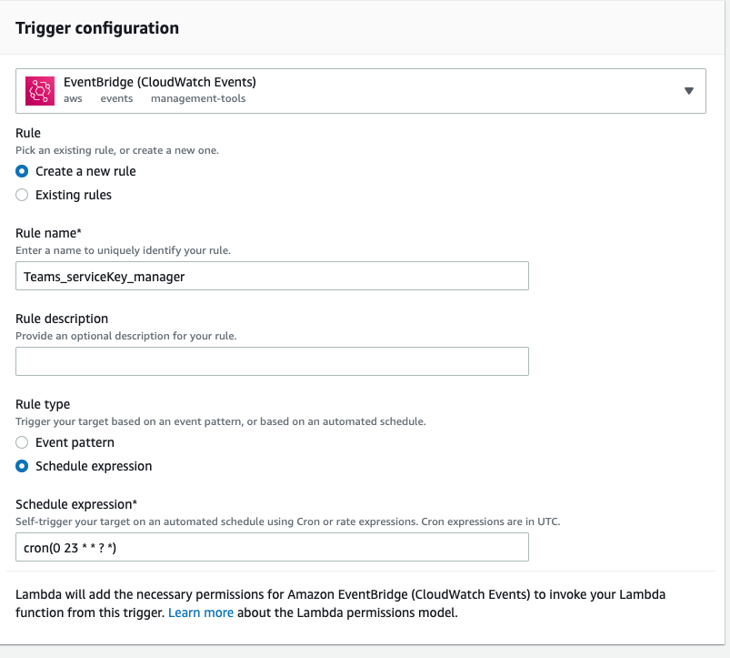
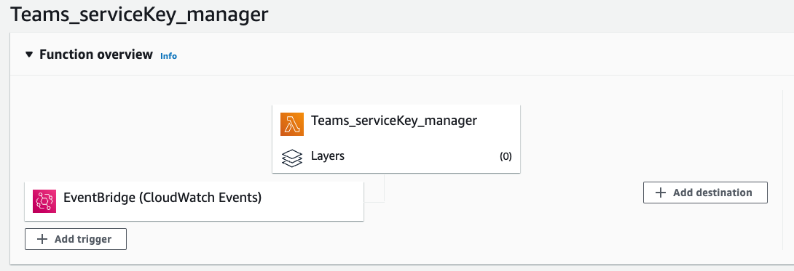
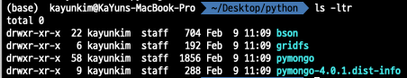
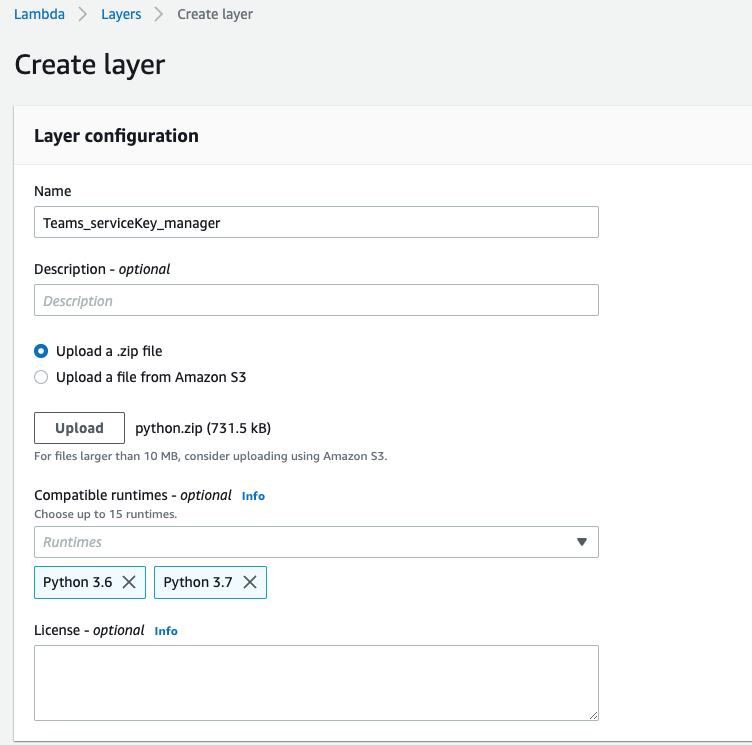
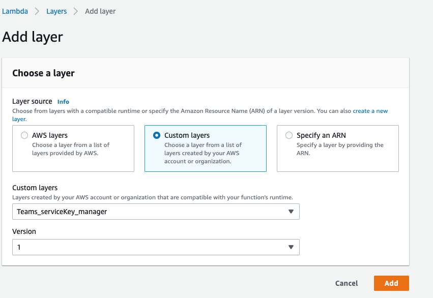
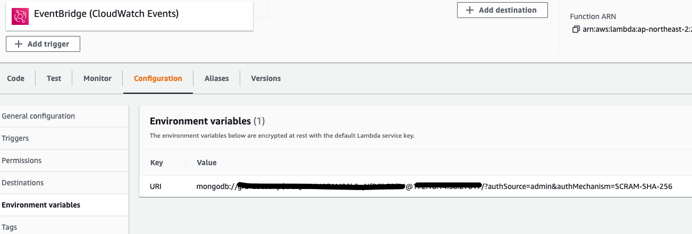

## AWS Lambda를 이용한 알림 메세지 보내기


### 1. AWS Lambda Function 생성하기 

1. Lambda 접속 후 > Create Function 클릭
2. Author from scratch 선택 후 아래 하단에 funtion name 생성, Runtime(함수 작성할 언어) 선택

3. 아래 Permissions에 AWS 서비스 사용 권한을 주기 위해 IAM role 설정(신규/기존)

4. 회사 망 내에서 사용하기 위해 Advanced settings에서 VPC와 Subnet, 그리고 Security Group을 차례대로 설정

5 . Create function 버튼 클릭!


Lambda Function을 만들었으면, 이 함수를 실행하기 위한 Trigger Event가 필요하다.

Trigger Event로는 API Gateway, SNS, EventBridge 등이 있는데, 매일 한번씩 알림 메세지를 보낼 계획이기 때문에 EventBridge에서 schedule event를 활용할 예정이다.


### 2. Amazon EventBridge 생성하기

1. Function 생성 후 overview 페이지에서 +Add trigger 클릭

2. EventBridge trigger 선택

3. Create a new rule 선택 후 이름 생성

4. Rule type에 Schedule expression 선택 후 cron 스케줄 입력

   작성 양식은 아래 참고:

   https://docs.aws.amazon.com/eventbridge/latest/userguide/eb-create-rule-schedule.html

5. 마지막으로 Add 클릭








### 3. AWS Lambda Function 함수 코드 작성하기

```
import os
import json
import urllib.request
import pymongo
import datetime


def post_slack(argStr):
    message = argStr
    send_data = {
        "text": message,
    }
    send_text = json.dumps(send_data)
    request = urllib.request.Request(
        # slack Alert
        "https://hooks.slack.com/services/TRD8WMQSF/...zA8", 
        data=send_text.encode('utf-8'), 
    )

    with urllib.request.urlopen(request) as response:
        slack_message = response.read()


def lambda_handler(event, context):
    
    # connect to MongoDB
    db_con = os.environ['URI']
    connection = pymongo.MongoClient(db_con)
    
    # connect to MongoDB Database
    database = connection.get_database('GB')
    
    today = datetime.datetime.today().strftime("%Y-%m-%d")
    last_month = datetime.datetime.today() - datetime.timedelta(days=30)
    last_month = last_month.strftime("%Y-%m-%d")
    
    data_cursor = database.get_collection('Site').find({"useCd":"US", "conEndDt":{"$gte" : last_month,  "$lte" : today} })
    # data_cursor = database.get_collection('Site').find({"conEndDt":{"$gte" : last_month,  "$lte" : today} })
    for data in data_cursor:
        print(data['siteNm'], data['serviceKey'], data['useCd'], data['conStartDt'], data['conEndDt'], data['seviceEndDt']) 
        
        siteNm = data['siteNm']
        serviceKey = data['serviceKey']
        useCd = data['useCd']
        conStartDt = data['conStartDt']
        conEndDt = data['conEndDt']
        seviceEndDt = data['seviceEndDt']
        
        post_slack('{} / {} \n{} ~ {} \n{}'.format(siteNm, serviceKey, conStartDt, conEndDt, seviceEndDt))
        post_slack('-------------------------------------')

```


MongoDB의 데이터를 확인해서 Slack에 매일 한 번씩 알림을 보내는 코드이다.

MongoDB의 접근해서 데이터를 불러와야 했으므로 pymongo 모듈을 사용했고, Lambda에서 파이썬 모듈을 사용하려면 Layers라는 기능을 생성 후 추가해줘야 한다.


### 4. Layers 생성하기

한마디로 로컬에서 필요한 모듈 설치 후 관련 패키지 폴더들을 zip으로 묶어 올려줌으로써 Lambda Function에서 활용할 수 있도록 하는 것이다.


0. 사전작업
   1. 로컬에서 python이라는 폴더명으로 폴더를 만들고 해당 경로에서 터미널 열기

   2. ```
      $ pip3 install {module} -t .
      ```

   3. python 파일 zip 압축하기




1. AWS Lamdba 콘솔에서 왼쪽 메뉴바의 Layers 클릭 후 Create layer 클릭\
2.  Name 입력 후 Upload zip file 선택 후 python.zip 파일 Upload
3. 사용할 파이썬 버전 선택 후 Create!





1. Function 페이지에서 하단의 Layers 클릭 후  Add a layer 클릭

2. Custom layers 선택 후 방금 만든 layers 선택 후 Add!

   


### 5. 환경변수 생성하기

마지막으로 mongoDB를 연결해주기 위한 URI 변수를 환경 변수에 등록해줘야 한다.

1. Configuration에서 Environment variables 클릭

2. Key와 Value 입력 후 Function 코드에서 사용

   ```
       db_con = os.environ['URI']
       connection = pymongo.MongoClient(db_con)
   ```



