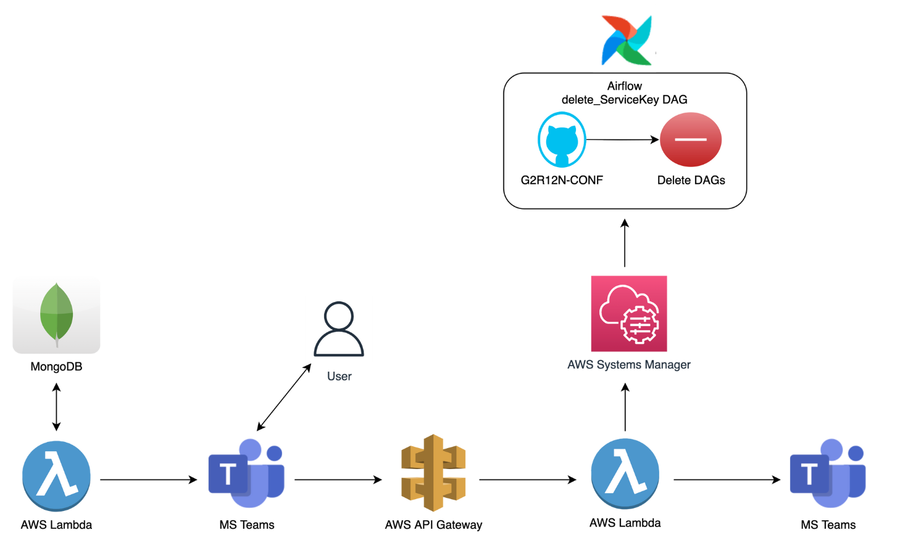

## 업무시작 배경

- 고객사 해지 요청이 왔을 때 업무 process:

  1. client.yml 고객사 setting정보(serviceKey) 삭제

  2. git update(add/commit/push)

  3. Airflow DAGs 삭제

     1. airflow 추천 서버 DAG 5개
     2. airflow 세그먼트 서버 DAG 2개

     

- 고객사 해지 요청이 없어 위 process가 이루어지지 않을 경우:

  1. AI 검색어 추천 모델 배포 실패
  2. cloudwatch log 내역 확인 위의 1,2,3 실행
  3. keyword_train DAG 수동 trigger
  4. 30일동안 DAG 학습 진행(비용)

  

👉 AI 검색어 추천 모델 배포 실패 방지, 해당 업무에 뺏기는 시간 & 업무 흐름 끊김 방지를 위한 파이프라인 구축 필요 결론

 

## Architecture

1. AWS Lambda - Teams_serviceKey_manager
   1. MongoDB에서 해지 대상 고객 (ex) 계약 만료 30일 전) info 가져오기
   2. Teams Webhook 연동 후 Actionalbe Message Card 기능으로 Teams에 알림 noti 보내기
2. MS Teams
   1. 해당 고객사 담당자가 Delete 버튼 클릭
3. AWS API Gateway
   1. Delete버튼에 연동되어 있는 HTTP API가 작동하고 이 API는 4번 Lambda를 호출함
4. AWS Lamba - deleteServiceKey
   1. AWS Systems Manager를 활용하여 Airflow main 서버 접속 후 delete_serviceKey DAG trigger
   2. clients.yml 파일 수정 후(고객사 삭제) git repo update
   3. 기존 생성 DAG들 삭제(rec&seg)
5. MS Teams
   1. 고객사 해지 알림 보내기

 

## 기대효과

1. 비용감소

   - 30일동안 돌아가는 DAG들 비용

   - 매일 돌아가는 keyword_train DAG 한번 더 돌리는 비용

2. AI 검색어 추천 모델 배포 실패 방지 & 수동 배포 작업 불필요

   - cloudwatch log 확인 후 keyword_train DAG 실행 작업 불필요

3. 영업팀 계약 만료 고객 사전에 인지하여 대응할 수 있도록 하기 위함

   - 영업팀 고객사 관리 차원

4. DE main업무에 집중

   - AI 검색어 추천 모델 수동 배포로 인한 업무흐름 끊김 방지